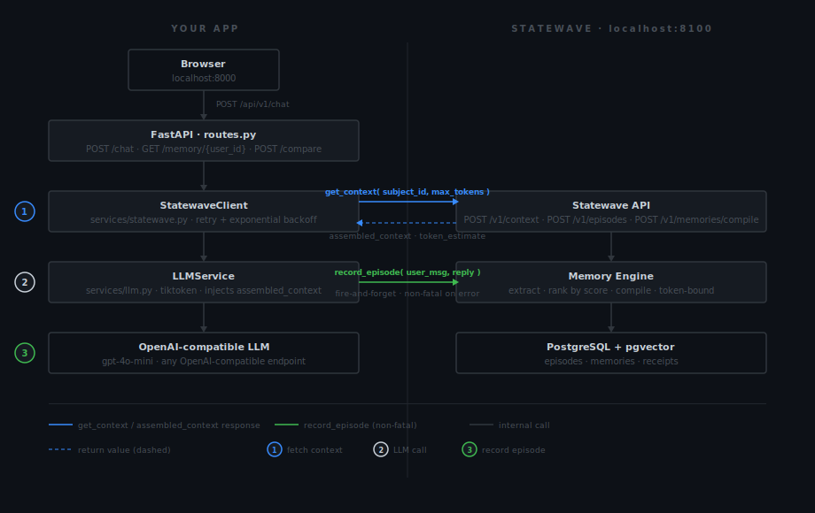

# statewave-personal-assistant

[](https://www.python.org/)
[](https://fastapi.tiangolo.com/)
[](https://github.com/smaramwbc/statewave-docs)
[](LICENSE)
[](#running-tests)
[](https://platform.openai.com/)

A working reference implementation that shows how to add **persistent, cross-session memory** to any Python chat application using [Statewave](https://github.com/smaramwbc/statewave-docs) and FastAPI.

Clone it, run it, and see the difference in under five minutes.

---

## The Problem This Solves

Every session-based chat application faces the same wall. When a user returns after closing the tab, the assistant remembers nothing. The standard workaround is to inject the full conversation history into every prompt, but this breaks quickly:

- After 8 to 10 turns, the context window is full
- Earlier facts are silently dropped to make room for recent ones
- The more sessions a user has, the worse the problem gets
- There is no ranking signal: a throwaway comment gets as much weight as a critical bug report

This is not a model limitation. It is an architecture problem.

---

## The Solution: Statewave

**Statewave** is an open-source, self-hosted memory runtime for AI agents. Instead of passing raw conversation history to the LLM, you pass conversations through Statewave, which:

1. **Extracts structured facts** from each conversation turn (user role, preferences, open issues, session summaries)
2. **Ranks those facts** by relevance and recency
3. **Returns only the highest-signal context** that fits within your token budget, as a ready-to-inject string

The result is an assistant that knows who the user is, what they have been building, and what is still unresolved, across every session, using a fraction of the tokens that raw history would consume.

Statewave is **self-hosted** (Apache 2.0), runs on **PostgreSQL with pgvector**, and requires no cloud account or external API key to operate.

---

## Core Concepts

If you are new to Statewave, these are the five terms you will encounter throughout this codebase.

### Episode

An episode is a single recorded conversation turn: one user message and one assistant response. Episodes are the raw input to Statewave. You record them after each turn using `POST /v1/episodes`.

Think of episodes as the raw log. Statewave reads from this log to build memories.

### Memory

A memory is a structured fact that Statewave extracts from one or more episodes. Memories are typed:

| Kind | What it stores |
|---|---|
| `profile_fact` | Stable facts about the user (role, language preference, timezone) |
| `open_issue` | Unresolved problems or bugs the user is working on |
| `episode_summary` | A compressed summary of what happened in a session |
| `preference` | Expressed preferences about tools, patterns, or workflows |

Memories are created by calling `POST /v1/memories/compile`. This is an explicit step, not automatic.

### Subject

A subject is the entity whose memory is being tracked. In a chat application, each user has their own subject. The `subject_id` is just a string you choose, for example `dev_alice` or `user_123`. All episodes and memories are scoped to a subject.

### Context Bundle

When a new message arrives, you ask Statewave for a context bundle via `POST /v1/context`. Statewave ranks all compiled memories for that subject, selects the highest-scored facts that fit within your token budget, and returns them as a single pre-assembled string called `assembled_context`. You inject this string directly into the LLM system prompt.

### Receipt

A receipt is an immutable, HMAC-signed audit record of every context assembly call. It captures exactly which facts were returned and why. Useful for debugging and compliance, not required for the core integration.

---

## How the Integration Works

Every chat request goes through a three-step loop. Two HTTP calls to Statewave wrap the LLM call: one before to fetch ranked context, one after to record the episode.



The integration surface is two API calls: `get_context` before the LLM call and `record_episode` after. That is the entire memory layer. See [`app/services/statewave.py`](app/services/statewave.py) for the implementation.

---

## Prerequisites

Before you begin, make sure you have:

- **Python 3.11 or newer** ([download](https://www.python.org/downloads/))
- **Docker and Docker Compose** (needed to run Statewave locally)
- **An API key** for an OpenAI-compatible LLM provider (OpenAI, Azure OpenAI, local Ollama, etc.)
- **Git** for cloning repositories

If you are unsure whether you have these installed, run the following in your terminal:

```bash
python --version    # should print 3.11.x or higher
docker --version    # should print Docker version ...
git --version       # should print git version ...
```

---

## Quick Start

### Step 1: Clone and install this repository

```bash
git clone https://github.com/statewave-ai/statewave-memory-quickstart.git
cd statewave-memory-quickstart

# Create an isolated Python environment (recommended)
python -m venv .venv

# Activate it
source .venv/bin/activate        # macOS / Linux
.venv\Scripts\activate           # Windows (Command Prompt)
# .venv\Scripts\Activate.ps1    # Windows (PowerShell)

# Install the application and its dependencies
pip install -e ".[dev]"
```

### Step 2: Configure your environment

```bash
cp .env.example .env
```

Open the `.env` file in any text editor and set your LLM API key:

```
LLM_API_KEY=your-api-key-here
```

Everything else has sensible defaults. A full list of available variables is in the [Environment Variables](#environment-variables) section at the bottom of this page.

### Step 3: Start Statewave locally

Statewave is a separate server that runs alongside your application. Clone and start it with Docker:

```bash
# In a new terminal window or tab, go up one level from this repo
cd ..

git clone https://github.com/smaramwbc/statewave
cd statewave
docker compose up -d
```

> **What is `docker compose up -d` doing?**
> It starts a PostgreSQL database (with the pgvector extension for vector search) and the Statewave API server in the background. The `-d` flag means "detached" so the containers run without blocking your terminal.

Statewave starts at `http://localhost:8100`. You can verify it is running:

```bash
curl http://localhost:8100/healthz
# Expected output: {"status":"ok"}
```

Go back to this repository's directory:

```bash
cd ../statewave-memory-quickstart
```

### Step 4: Seed demo users

This step populates Statewave with two fictional developer profiles that have realistic conversation histories. It is what makes the demo useful out of the box.

```bash
python -m scripts.seed
```

You will see output like:

```
 Statewave Memory Quickstart  Seed Script
Target: http://localhost:8100
Seeding 2 demo users...

  Seeding dev_alice  Alice Chen...   done
  Seeding dev_bob  Bob Martinez...   done

User ID    Name           Episodes    Memories Compiled    Errors
dev_alice  Alice Chen     4           12                   0
dev_bob    Bob Martinez   6           18                   0

Done. Open http://localhost:8000 after starting the server.
```

> **What are `dev_alice` and `dev_bob`?**
> Alice is an indie developer building a RAG-based code assistant. Bob is a developer building a Slack bot for his team. Their conversation histories cover realistic LLM API challenges: rate limits, chunking strategies, streaming, function calling, error handling, and token counting. When you chat with the demo, the assistant can reference these past conversations.

### Step 5: Start the application

```bash
uvicorn app.main:app --reload
```

Open **[http://localhost:8000](http://localhost:8000)** in your browser.

The `--reload` flag makes the server restart automatically when you edit source files, which is useful during development.

---

## Using the Web Interface

The chat interface at `http://localhost:8000` is designed to make the memory layer visible, not just functional.

```
+---------------------------+------------------------------+
|  dev_alice  [switcher]    |  Memory State     [refresh]  |
+---------------------------+------------------------------+
|                           |                              |
|  [chat panel]             |  [memory panel]              |
|                           |                              |
|  Messages appear here.    |  Every compiled fact about   |
|  Each assistant reply     |  the current user appears    |
|  shows:                   |  here, grouped by kind:      |
|  - memory / no memory     |                              |
|  - episode ID             |  profile_fact   score: 1.00  |
|  - token count used       |  open_issue     score: 0.94  |
|                           |  episode_summary score: 0.87 |
+---------------------------+------------------------------+
|  [hint chips]  What was the bug I was debugging last...  |
+----------------------------------------------------------+
|  Type a message...                          [Send]       |
+----------------------------------------------------------+
```

**Left panel (chat):** This is where you talk to the assistant. Every reply from the assistant shows a badge indicating whether memory context was used, the episode ID of this turn, and how many tokens the memory context consumed.

**Right panel (memory state):** This shows every compiled memory fact Statewave has for the selected user. Facts are grouped by kind, sorted by score, and each one shows which episode it came from. This panel refreshes automatically after each assistant reply so you can watch memory accumulate in real time.

**User switcher (top bar):** Switch between `dev_alice`, `dev_bob`, or type any custom user ID. The memory panel updates immediately to show that user's compiled facts.

**Hint chips:** Pre-written prompts that are good starting points for testing memory recall. Click one to send it directly.

---

## CLI Demo Commands

If you prefer the terminal, four commands demonstrate the memory pattern:

### Compare: memory vs. no memory

```bash
python -m scripts.compare compare --user dev_alice \
  --message "What was the bug I was debugging last session?"
```

Sends the same message to two assistants simultaneously and prints the responses side by side. The left side has no memory. The right side has Statewave context injected.

```
  User message  dev_alice
  What was the bug I was debugging last session?

+----------------------------------+  +----------------------------------+
|  Stateless                       |  |  Statewave-backed                |
|  No memory                       |  |  3 memories  ~280 tokens         |
|                                  |  |                                  |
|  I don't have any record of      |  |  Last session you were hitting   |
|  previous conversations. Could   |  |  429s on batch embedding jobs.   |
|  you describe the issue?         |  |  There is an undocumented per-IP |
|                                  |  |  burst limit (~500 req/10s).     |
|                                  |  |  Did the tenacity backoff fix    |
|                                  |  |  resolve it?                     |
+----------------------------------+  +----------------------------------+
```

Same model. Same prompt structure. Only the memory layer differs.

### Inspect: see what the agent knows

```bash
python -m scripts.compare inspect --user dev_alice
```

Prints every compiled memory fact for a user. This is useful for understanding what context will be injected before a conversation starts.

```
3 memories compiled.  profile_fact: 1  open_issue: 1  episode_summary: 1

+--------------------------------------------------------------------------+
| [profile_fact]  score=1.00  source=ep_001  tags=['role', 'python']       |
|                                                                          |
| Indie developer building a RAG-based code assistant. Python only.        |
+--------------------------------------------------------------------------+

+--------------------------------------------------------------------------+
| [open_issue]  score=0.94  source=ep_002  tags=['embeddings', '429']      |
|                                                                          |
| Intermittent 429 errors on batch embed jobs. Likely undocumented         |
| per-IP burst limit. Workaround: tenacity retry with exponential backoff. |
+--------------------------------------------------------------------------+
```

`score` is Statewave's confidence in the memory fact. `source` is the episode ID that generated it. When the token budget is tight, higher-scored facts are always injected first.

### Budget: token budget enforcement

```bash
python -m scripts.compare budget --user dev_bob
```

Calls Statewave three times with different token budgets and shows how many memories fit at each limit.

```
+------------+----------------+-------------------+--------------------------+
| max_tokens | token_estimate | memories_returned | context preview          |
+------------+----------------+-------------------+--------------------------+
|        200 |            178 |                 2 | Dev building Slack bot   |
|        500 |            443 |                 4 | Dev building Slack bot   |
|        800 |            761 |                 6 | Dev building Slack bot   |
+------------+----------------+-------------------+--------------------------+

dev_bob has 6 sessions  ~2,800 tokens of raw history
Statewave at max_tokens=800  ~761 tokens of ranked signal
```

This demonstrates the core value proposition: raw history grows linearly with no ranking. Statewave always fits within your budget and always returns the highest-value facts first.

### Chat: interactive terminal session

```bash
python -m scripts.compare chat --user dev_alice
```

Opens an interactive terminal chat session backed by Statewave. Each response shows how many memories were used and the token estimate. Each turn is recorded as a new episode, so memory accumulates as you chat.

---

## API Reference

The application exposes three HTTP endpoints.

### POST /api/v1/chat

Send a user message and receive a memory-backed assistant response.

**Request body**

```json
{
  "user_id": "dev_alice",
  "message": "How do I handle 429s in batch jobs?"
}
```

| Field | Type | Required | Description |
|---|---|---|---|
| `user_id` | string | Yes | The subject ID. Any string. Created automatically on first use. |
| `message` | string | Yes | The user's message. |

**Response body**

```json
{
  "user_id": "dev_alice",
  "message": "How do I handle 429s in batch jobs?",
  "response": "You hit this last session. Use tenacity with exponential backoff...",
  "episode_id": "ep_0012",
  "context_used": true,
  "token_estimate": 283
}
```

| Field | Type | Description |
|---|---|---|
| `response` | string | The assistant's reply. |
| `episode_id` | string | The Statewave episode ID for this turn. |
| `context_used` | boolean | `true` if at least one memory fact was injected. |
| `token_estimate` | integer | Tokens consumed by the assembled memory context. |

### GET /api/v1/memory/{user_id}

Returns all compiled memory facts for a user. Useful for debugging what the assistant knows before a conversation starts.

```bash
curl http://localhost:8000/api/v1/memory/dev_alice
```

### GET /health

Returns `{ "status": "ok" }`. Used by the UI health indicator in the top bar.

---

## Project Structure

```
statewave-memory-quickstart/
|
|-- app/                            Main application package
|   |-- api/
|   |   +-- routes.py              Two endpoints: POST /chat, GET /memory/{user_id}
|   |-- core/
|   |   +-- config.py              All settings loaded from .env via Pydantic
|   |-- data/
|   |   +-- profiles.py            dev_alice and dev_bob episode histories (seed data)
|   |-- models/
|   |   |-- chat.py                ChatRequest and ChatResponse Pydantic schemas
|   |   +-- memory.py              ContextBundle, MemoryState Pydantic schemas
|   |-- services/
|   |   |-- llm.py                 Async OpenAI wrapper; injects assembled_context
|   |   +-- statewave.py           Statewave HTTP client (record, compile, context, search)
|   |-- static/
|   |   +-- index.html             Single-page chat UI (no build step required)
|   +-- main.py                    FastAPI app; mounts static files; defines GET /
|
|-- scripts/
|   |-- seed.py                    Reads profiles.py, writes episodes, compiles memories
|   +-- compare.py                 CLI commands: compare / inspect / budget / chat
|
|-- tests/                         24 tests; all HTTP calls are mocked
|   |-- conftest.py                Shared fixtures (mock Statewave, mock OpenAI)
|   |-- test_routes.py             Route-level integration tests
|   |-- test_statewave_client.py   Unit tests for the Statewave client
|   +-- test_llm_service.py        Unit tests for the LLM service
|
|-- .env.example                   Copy this to .env and fill in your keys
|-- pyproject.toml                 Dependencies and project metadata
+-- README.md
```

### Key files to read first

If you want to understand the memory pattern and adapt it to your own project, read these three files in order:

1. [`app/services/statewave.py`](app/services/statewave.py) -- The Statewave client. Four methods: `record_episode`, `compile_memories`, `get_context`, `list_memories`. This is the complete memory integration surface.
2. [`app/api/routes.py`](app/api/routes.py) -- The chat route. Shows exactly where `get_context` is called (before the LLM) and where `record_episode` is called (after).
3. [`app/services/llm.py`](app/services/llm.py) -- The LLM wrapper. Shows how `assembled_context` is inserted into the system prompt.

---

## Extending This

### Swap the LLM provider

Replace `app/services/llm.py` with any OpenAI-compatible provider (Azure OpenAI, Anthropic via a compatibility layer, local Ollama). The Statewave layer is completely provider-agnostic. `assembled_context` is a plain string that goes into any system prompt.

### Add a real user

Call `POST /api/v1/chat` with any `user_id` string. Statewave creates the subject on the first episode write. No registration or setup step is needed. After a few turns, call `POST /v1/memories/compile` (via the Statewave API directly, or through your own scheduled job) to compile memories from their episodes.

### Replace the demo data with your own

Edit `app/data/profiles.py` and re-run `python -m scripts.seed`. Each profile is a list of `{ user_message, assistant_response }` pairs. Statewave extracts structured memory facts from each pair automatically during compilation.

### Run memory compilation on a schedule

In production, you would not compile memories after every single episode. Instead, run compilation on a schedule: after every N episodes, or on a daily cron job. The Statewave API supports async compilation via `POST /v1/memories/compile` with `"async": true`, which returns a `job_id` you can poll.

### Deploy Statewave in production

Statewave runs on any PostgreSQL instance with the pgvector extension enabled. Point `STATEWAVE_BASE_URL` at your deployed instance. If you enable Statewave's optional API key authentication, set `STATEWAVE_API_KEY` in your environment. The client in `app/services/statewave.py` already handles the `X-Api-Key` header.

---

## Running Tests

No API keys or running servers are required to run the test suite. All HTTP calls to both the LLM and Statewave are mocked.

```bash
# Run all 24 tests
pytest -v

# Run tests for a specific file
pytest tests/test_routes.py -v

# Run a single test by name
pytest tests/test_routes.py::test_chat_endpoint -v

# Lint the codebase
ruff check .

# Type check
mypy app scripts
```

---

## Environment Variables

Copy `.env.example` to `.env` and configure the variables below. Only `LLM_API_KEY` is required to get started.

| Variable | Required | Default | Description |
|---|---|---|---|
| `LLM_API_KEY` | Yes | | API key for your LLM provider. Works with any OpenAI-compatible API. |
| `OPENAI_MODEL` | No | `gpt-4o-mini` | Model identifier passed to the LLM API. |
| `STATEWAVE_BASE_URL` | No | `http://localhost:8100` | Base URL of the Statewave server. Change this for production deployments. |
| `STATEWAVE_MAX_TOKENS` | No | `800` | Maximum tokens Statewave may use for an assembled context bundle. Lower values = fewer facts injected but less LLM cost per request. |
| `STATEWAVE_API_KEY` | No | | API key for Statewave, if you have enabled authentication on your Statewave instance. Leave empty for local development. |
| `HOST` | No | `0.0.0.0` | Address the application server binds to. |
| `PORT` | No | `8000` | Port the application server listens on. |

---

## Frequently Asked Questions

**Do I need a Statewave account?**
No. Statewave is self-hosted and open source (Apache 2.0). You run it yourself with Docker. There is no SaaS plan, no sign-up, and no vendor API key.

**Does this only work with OpenAI?**
No. The LLM service in `app/services/llm.py` uses the OpenAI Python SDK, but any provider that is compatible with the OpenAI API format will work. The Statewave layer is completely decoupled from the LLM provider.

**What happens if Statewave is down?**
The `record_episode` call at the end of each request is fire-and-forget: if it fails, the chat response is still returned to the user. The `get_context` call at the start of the request will return an empty context on failure, so the assistant responds without memory rather than returning an error.

**How do memories get updated over time?**
New episodes are recorded after every conversation turn. Memories are compiled from episodes when you call `POST /v1/memories/compile`. In this demo, compilation happens during the seed step. In production, you would run compilation periodically, for example after every 5 new episodes or on a nightly cron job.

**Can I see exactly what context was injected for a given response?**
Yes. Each `ChatResponse` includes `episode_id` and `token_estimate`. You can call `GET /api/v1/memory/{user_id}` to see all compiled memories, and the right panel of the web UI shows the same information live after each response.

---

## License

MIT. See [LICENSE](LICENSE).

---

## Related Resources

- [Statewave Documentation](https://github.com/smaramwbc/statewave-docs)
- [Statewave Source Code](https://github.com/smaramwbc/statewave)
- [FastAPI Documentation](https://fastapi.tiangolo.com/)
- [OpenAI Python SDK](https://github.com/openai/openai-python)
- [pgvector](https://github.com/pgvector/pgvector)
